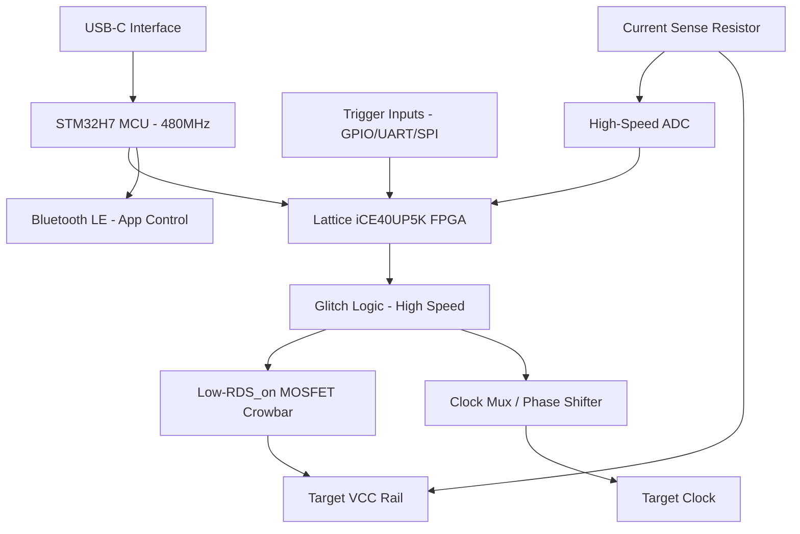

# Phase 1: Conceptual Architecture - Volt-Glitcher

## System Purpose
The **Volt-Glitcher** is a precision hardware security research tool designed for **Fault Injection (FI)** attacks. It specifically targets **Voltage Glitching** and **Clock Glitching** to disrupt the execution flow of target microcontrollers, allowing researchers to bypass secure boot checks, skip instruction execution (e.g., password comparisons), and dump protected memory.

## Attack Surface
- **Target VCC**: Precise control and rapid crowbarring (shorting) of the target's power rail.
- **Target CLK**: Interception and manipulation of the target's clock signal to introduce timing faults.
- **Trigger Inputs**: Real-time monitoring of UART, SPI, or GPIO patterns to trigger glitches with sub-microsecond precision.
- **Side-Channel Analysis**: Low-side current sensing to correlate power consumption with instruction execution for precise trigger timing.

## Performance Targets
- **Glitch Pulse Width**: 5ns to 1ms, adjustable in 1ns increments.
- **Trigger Latency**: < 50ns from trigger event to glitch execution.
- **Voltage Range**: 0.8V to 5.0V for target power rails.
- **Maximum Current**: 2A peak pulse current during crowbar glitch.
- **Sampling Rate**: 100 MSPS for trigger pattern matching (via high-speed comparator/FPGA logic).

## Constraints
- **BOM Cost**: < $100.
- **Form Factor**: Portable, handheld device (approx. 60mm x 40mm).
- **Power**: USB-C powered.
- **Safety**: Isolation between the glitcher logic and the target to prevent back-powering or damage to the host.

## Block Diagram

## Data Flow
1. **Configuration**: The user sets glitch parameters (delay, width, voltage, trigger pattern) via the React Native app or USB serial.
2. **Triggering**: The FPGA monitors the `Trigger Inputs`. When the pattern is matched, it signals the `Glitch Logic`.
3. **Execution**: The `Glitch Logic` waits for the configured `delay` and then activates the `MOSFET Crowbar` for the specified `width`.
4. **Feedback**: The `High-Speed ADC` captures the power trace during the glitch and sends it back to the MCU for visualization in the app.

## Bus Topology
- **Internal High-Speed**: FPGA-MCU link via 8-bit parallel bus (FMC) or high-speed SPI (50MHz).
- **Target Interface**: Level-shifted GPIOs (1.2V to 5V compatible).
- **Control**: I2C for power management and DACs (setting glitch voltage thresholds).
- **Host**: USB 2.0 High-Speed (480Mbps) via STM32H7 internal PHY.
